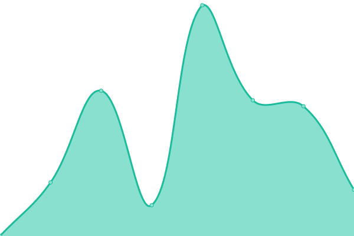

# [📈 Live Status](https://status.stis.ac.id): <!--live status--> **🟩 All systems operational**

This repository contains the open-source uptime monitor and status page for [Upptime](https://upptime.js.org), powered by [Upptime](https://github.com/upptime/upptime).

With [Upptime](https://upptime.js.org), you can get your own unlimited and free uptime monitor and status page, powered entirely by a GitHub repository. We use [Issues](https://github.com/upptime/upptime/issues) as incident reports, [Actions](https://github.com/upptime/upptime/actions) as uptime monitors, and [Pages](https://status.stis.ac.id) for the status page.

<!--start: status pages-->
<!-- This summary is generated by Upptime (https://github.com/upptime/upptime) -->
<!-- Do not edit this manually, your changes will be overwritten -->
<!-- prettier-ignore -->
| URL | Status | History | Response Time | Uptime |
| --- | ------ | ------- | ------------- | ------ |
|  [Web STIS](https://stis.ac.id) | 🟩 Up | [web-stis.yml](https://github.com/im-perativa/stis-uptime/commits/HEAD/history/web-stis.yml) | 

 5919ms
     
 | 

<a href="https://status.stis.ac.id/history/web-stis">100.00%</a>
    

|  [SIPADU (Old)](https://stis.ac.id/sipadu/mahasiswa/index.php/login/index) | 🟩 Up | [sipadu-old.yml](https://github.com/im-perativa/stis-uptime/commits/HEAD/history/sipadu-old.yml) | 

 271ms
     
 | 

<a href="https://status.stis.ac.id/history/sipadu-old">100.00%</a>
    

|  [SIPADU NG](https://perkuliahan.sipadu.stis.ac.id) | 🟩 Up | [sipadu-ng.yml](https://github.com/im-perativa/stis-uptime/commits/HEAD/history/sipadu-ng.yml) | 

 5244ms
     
 | 

<a href="https://status.stis.ac.id/history/sipadu-ng">100.00%</a>
    

|  [Web Student](https://student.stis.ac.id) | 🟩 Up | [web-student.yml](https://github.com/im-perativa/stis-uptime/commits/HEAD/history/web-student.yml) | 

 6156ms
     
 | 

<a href="https://status.stis.ac.id/history/web-student">100.00%</a>
    

|  [Remotelab](https://remotelab.stis.ac.id) | 🟩 Up | [remotelab.yml](https://github.com/im-perativa/stis-uptime/commits/HEAD/history/remotelab.yml) | 

 5795ms
     
 | 

<a href="https://status.stis.ac.id/history/remotelab">100.00%</a>
    

|  [SIMPUS](https://perpustakaan.stis.ac.id) | 🟩 Up | [simpus.yml](https://github.com/im-perativa/stis-uptime/commits/HEAD/history/simpus.yml) | 

 5198ms
     
 | 

<a href="https://status.stis.ac.id/history/simpus">100.00%</a>
    

|  [Git](https://git.stis.ac.id) | 🟩 Up | [git.yml](https://github.com/im-perativa/stis-uptime/commits/HEAD/history/git.yml) | 

 2271ms
     
 | 

<a href="https://status.stis.ac.id/history/git">100.00%</a>
    

<!--end: status pages-->

[**Visit our status website →**](https://status.stis.ac.id)

## 📄 License

- Powered by: [Upptime](https://github.com/upptime/upptime)
- Code: [MIT](./LICENSE) © [Upptime](https://upptime.js.org)
- Data in the `./history` directory: [Open Database License](https://opendatacommons.org/licenses/odbl/1-0/)
