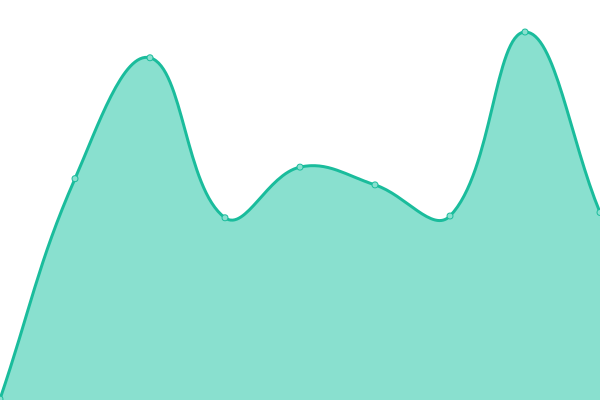
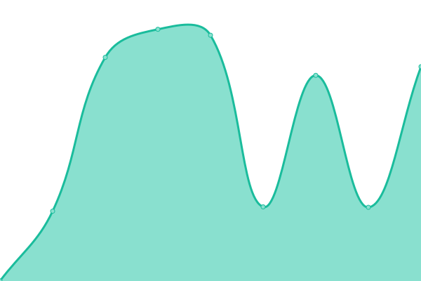
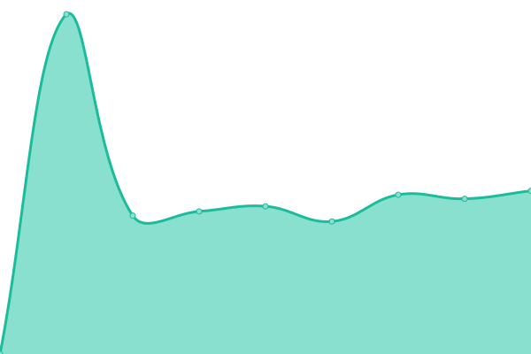

# [📈 Live Status](https://status.stis.ac.id): <!--live status--> **🟧 Partial outage**

This repository contains the open-source uptime monitor and status page for [Upptime](https://upptime.js.org), powered by [Upptime](https://github.com/upptime/upptime).

With [Upptime](https://upptime.js.org), you can get your own unlimited and free uptime monitor and status page, powered entirely by a GitHub repository. We use [Issues](https://github.com/upptime/upptime/issues) as incident reports, [Actions](https://github.com/im-perativa/stis-uptime/actions) as uptime monitors, and [Pages](https://status.stis.ac.id) for the status page.

<!--start: status pages-->
<!-- This summary is generated by Upptime (https://github.com/upptime/upptime) -->
<!-- Do not edit this manually, your changes will be overwritten -->
<!-- prettier-ignore -->
| URL | Status | History | Response Time | Uptime |
| --- | ------ | ------- | ------------- | ------ |
|  [Web STIS](https://stis.ac.id) | 🟩 Up | [web-stis.yml](https://github.com/im-perativa/stis-uptime/commits/HEAD/history/web-stis.yml) | 

 1279ms
     
 | 

<a href="https://status.stis.ac.id/history/web-stis">100.00%</a>
    

|  [SIPADU (Old)](https://stis.ac.id/sipadu/mahasiswa/index.php/login/index) | 🟩 Up | [sipadu-old.yml](https://github.com/im-perativa/stis-uptime/commits/HEAD/history/sipadu-old.yml) | 

 264ms
     
 | 

<a href="https://status.stis.ac.id/history/sipadu-old">100.00%</a>
    

|  [SIPADU NG](https://ws.sipadu.stis.ac.id/login) | 🟩 Up | [sipadu-ng.yml](https://github.com/im-perativa/stis-uptime/commits/HEAD/history/sipadu-ng.yml) | 

 1633ms
     
 | 

<a href="https://status.stis.ac.id/history/sipadu-ng">99.41%</a>
    

|  [SIPADU OAuth](https://ws.stis.ac.id) | 🟩 Up | [sipadu-o-auth.yml](https://github.com/im-perativa/stis-uptime/commits/HEAD/history/sipadu-o-auth.yml) | 

 1814ms
     
 | 

<a href="https://status.stis.ac.id/history/sipadu-o-auth">99.68%</a>
    

|  [Web Student/Skripsi](https://student.stis.ac.id) | 🟥 Down | [web-student-skripsi.yml](https://github.com/im-perativa/stis-uptime/commits/HEAD/history/web-student-skripsi.yml) | 

 0ms
     
 | 

<a href="https://status.stis.ac.id/history/web-student-skripsi">0.00%</a>
    

|  [Remotelab](https://remotelab.stis.ac.id) | 🟥 Down | [remotelab.yml](https://github.com/im-perativa/stis-uptime/commits/HEAD/history/remotelab.yml) | 

 1556ms
     
 | 

<a href="https://status.stis.ac.id/history/remotelab">0.00%</a>
    

|  [SIMPUS](https://simpus.stis.ac.id) | 🟩 Up | [simpus.yml](https://github.com/im-perativa/stis-uptime/commits/HEAD/history/simpus.yml) | 

 2050ms
     
 | 

<a href="https://status.stis.ac.id/history/simpus">99.22%</a>
    

|  [SIMPUS-API](https://api-simpus.stis.ac.id) | 🟩 Up | [simpus-api.yml](https://github.com/im-perativa/stis-uptime/commits/HEAD/history/simpus-api.yml) | 

 1697ms
     
 | 

<a href="https://status.stis.ac.id/history/simpus-api">65.60%</a>
    

|  [Gitlab](https://git.stis.ac.id) | 🟩 Up | [gitlab.yml](https://github.com/im-perativa/stis-uptime/commits/HEAD/history/gitlab.yml) | 

 1787ms
     
 | 

<a href="https://status.stis.ac.id/history/gitlab">99.01%</a>
    

|  [Link Shortener](https://s.stis.ac.id) | 🟥 Down | [link-shortener.yml](https://github.com/im-perativa/stis-uptime/commits/HEAD/history/link-shortener.yml) | 

 1229ms
     
 | 

<a href="https://status.stis.ac.id/history/link-shortener">93.50%</a>
    

|  [Jurnal ASKS](https://jurnal.stis.ac.id) | 🟩 Up | [jurnal-asks.yml](https://github.com/im-perativa/stis-uptime/commits/HEAD/history/jurnal-asks.yml) | 

 2708ms
     
 | 

<a href="https://status.stis.ac.id/history/jurnal-asks">98.99%</a>
    

|  [Repo STIS](https://repo.stis.ac.id) | 🟥 Down | [repo-stis.yml](https://github.com/im-perativa/stis-uptime/commits/HEAD/history/repo-stis.yml) | 

 0ms
     
 | 

<a href="https://status.stis.ac.id/history/repo-stis">0.00%</a>
    

|  [Profil Dosen STIS](https://stis.ac.id/dosen) | 🟩 Up | [profil-dosen-stis.yml](https://github.com/im-perativa/stis-uptime/commits/HEAD/history/profil-dosen-stis.yml) | 

 1297ms
     
 | 

<a href="https://status.stis.ac.id/history/profil-dosen-stis">46.50%</a>
    

|  [Prosiding (SEMNAS)](https://prosiding.stis.ac.id) | 🟩 Up | [prosiding-semnas.yml](https://github.com/im-perativa/stis-uptime/commits/HEAD/history/prosiding-semnas.yml) | 

 2925ms
     
 | 

<a href="https://status.stis.ac.id/history/prosiding-semnas">100.00%</a>
    

|  [Prosiding Internasional (ICDSOS)](https://proceedings.stis.ac.id/icdsos) | 🟩 Up | [prosiding-internasional-icdsos.yml](https://github.com/im-perativa/stis-uptime/commits/HEAD/history/prosiding-internasional-icdsos.yml) | 

 3716ms
     
 | 

<a href="https://status.stis.ac.id/history/prosiding-internasional-icdsos">99.00%</a>
    

|  [SISTER Politeknik Statistika STIS](https://sister.stis.ac.id) | 🟥 Down | [sister-politeknik-statistika-stis.yml](https://github.com/im-perativa/stis-uptime/commits/HEAD/history/sister-politeknik-statistika-stis.yml) | 

 0ms
     
 | 

<a href="https://status.stis.ac.id/history/sister-politeknik-statistika-stis">0.00%</a>
    

|  [Web Alumni STIS](https://alumni.stis.ac.id) | 🟩 Up | [web-alumni-stis.yml](https://github.com/im-perativa/stis-uptime/commits/HEAD/history/web-alumni-stis.yml) | 

 1428ms
     
 | 

<a href="https://status.stis.ac.id/history/web-alumni-stis">99.71%</a>
    

<!--end: status pages-->

[**Visit our status website →**](https://status.stis.ac.id)

## 📄 License

- Powered by: [Upptime](https://github.com/upptime/upptime)
- Code: [MIT](./LICENSE) © [Upptime](https://upptime.js.org)
- Data in the `./history` directory: [Open Database License](https://opendatacommons.org/licenses/odbl/1-0/)
